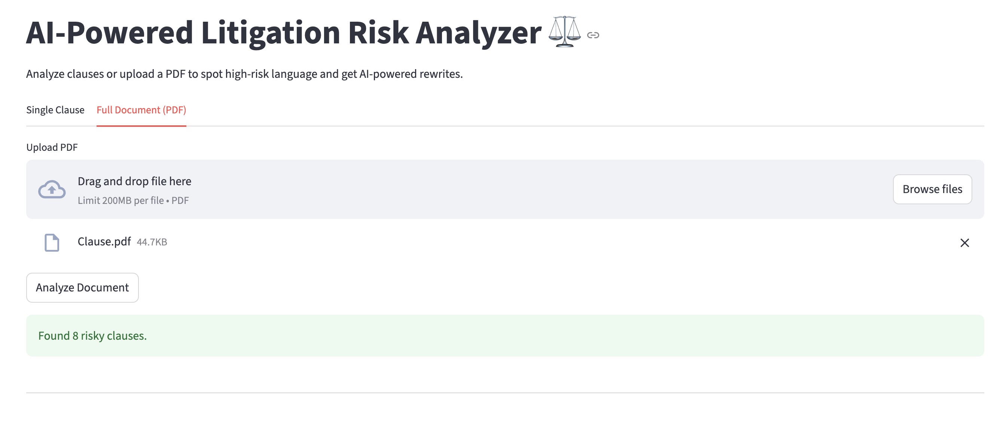
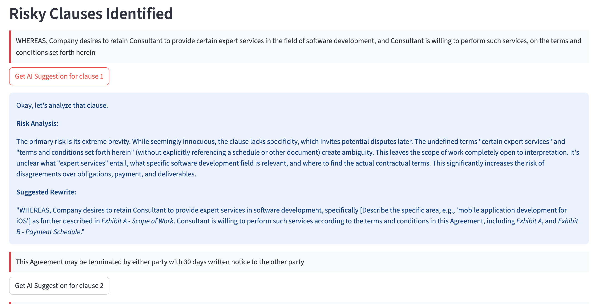

AI-Powered Litigation Risk Analyzer
This project is an end-to-end web application that leverages Natural Language Processing (NLP) and Generative AI to analyze legal contract clauses, predict their potential litigation risk, and provide AI-powered suggestions for improvement.

Screenshot:

Key Features
Risk Classification: Analyzes contract clauses and classifies them into High, Medium, or Low litigation risk categories using a fine-tuned machine learning model.

Full Document Analysis: Upload a complete contract in PDF format to automatically extract text and identify the top 10 riskiest clauses.

AI-Powered Suggestions: Utilizes the Google Gemini API to generate concise, expert-level risk analyses and suggested rewrites for high and medium-risk clauses.

Interactive UI: A clean and user-friendly web interface built with Streamlit, featuring separate workflows for single-clause and full-document analysis.

MLOps Architecture: Built with a professional MLOps structure, including a modular pipeline for data ingestion, transformation, and model training.

Technology Stack
Backend: Flask

Frontend: Streamlit

Machine Learning: LightGBM, Scikit-learn

NLP & Embeddings: Sentence-Transformers (legal-bert-base-uncased)

Generative AI: Google Gemini API

Data Handling: Pandas, NumPy

PDF Processing: PyPDF2

Containerization: Docker

Setup and Installation
Follow these steps to set up and run the project locally.

1. Clone the Repository

git clone https://github.com/Satyam999999/LegalMind-Intelligent-Risk-Analyzer.git
cd litigation-risk-analyzer

2. Create a Virtual Environment

python -m venv venv
source venv/bin/activate  # On Windows, use `venv\Scripts\activate`

3. Install Dependencies

pip install -r requirements.txt

4. Set Up Your API Key

Create a file named .env in the root directory of the project.

Add your Gemini API key to this file as follows:

GEMINI_API_KEY="YOUR_API_KEY_HERE"

5. Download the Dataset

Download the CUAD v1 dataset from The Atticus Project.

Create a data folder in the project's root directory.

Place the master_clauses.csv file inside the data folder.

6. Run the Training Pipeline
This is a one-time step to process the data and train the machine learning model. This will create the necessary artifacts in the artifacts/ directory.

python src/pipeline/training_pipeline.py

7. Run the Application
Once the training pipeline is complete, you can start the web application.

streamlit run app.py

The application will be available at http://localhost:8501.

